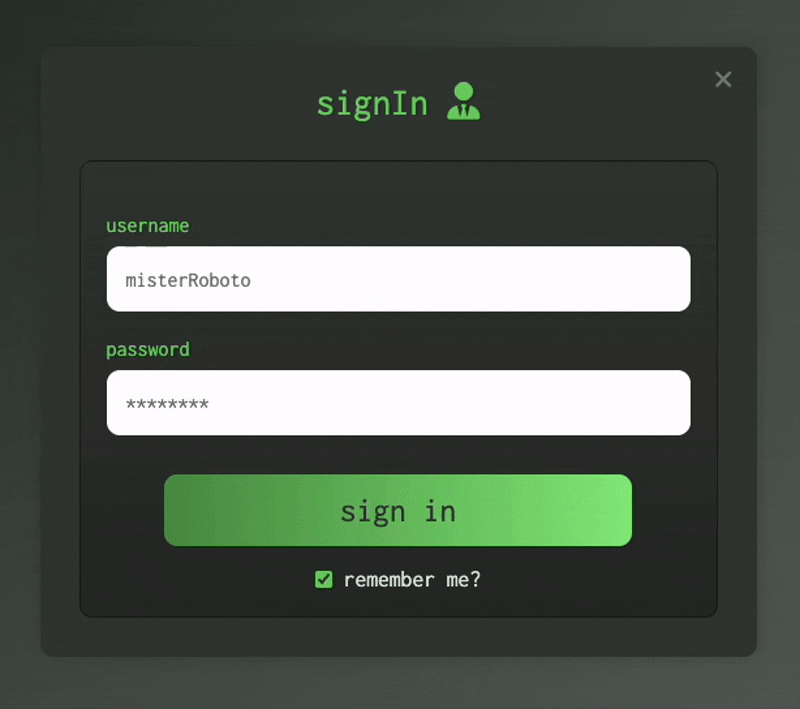
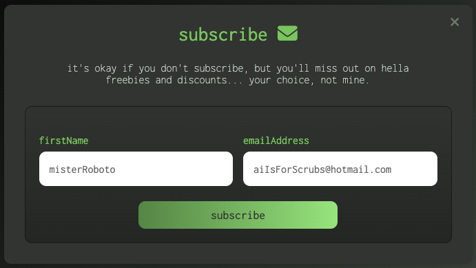

# Responsive Modal Windows &color=%23509348>)

Templates for various types of modal windows, including a sign in modal, sign up modal, newsletter modal, and more.





## How to view templates

- Click the link in 'About' section

## Installation

```
Download ZIP and open in IDE
```

or

```
git clone https://github.com/marceosayo/Responsive-Modal-Windows
```

## License

[MIT](https://choosealicense.com/licenses/mit/)
